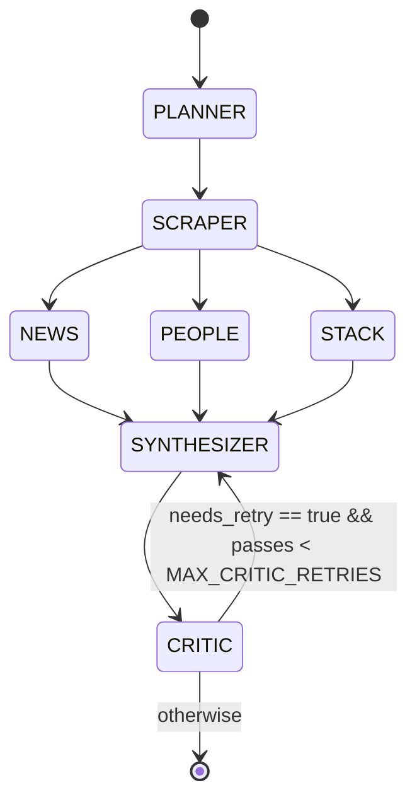

# Architecture

## State machine



### Why scraper is serialized before the parallel fan-out

The original spec described all four research tools (scraper, news, people,
stack) as parallel children of the planner. In implementation, three of those
tools benefit substantially from scraper output:

- **NEWS** uses the scraper-derived `detected_name` as the search token. The
  fallback (raw URL or domain) is workable but produces noisier results.
- **PEOPLE** uses the same token in role-targeted queries; without it, the
  matches drift toward unrelated companies sharing a domain prefix.
- **STACK** is the strongest case: signature detection runs against the pages
  scraper fetched. Without scrape output it would have to do its own fetch,
  duplicating bandwidth and rate-limit budget.

So the topology is `PLANNER → SCRAPER → parallel(NEWS, PEOPLE, STACK) →
SYNTHESIZER → CRITIC`. The fan-out demonstrates concurrent orchestration; the
serialized scrape demonstrates honest dependency-aware design.

This refinement is a deliberate departure from the spec, captured here for
auditability.

## Schemas

The agent state is `backend/app/schemas/state.AgentState`, a strict Pydantic
`BaseModel` with `extra="forbid"`. Every node returns a partial dict whose keys
are merged into state by LangGraph. Disjoint keys per node mean the parallel
fan-out merges cleanly.

| Field           | Owner node     | Type                        |
|-----------------|----------------|-----------------------------|
| `meta`          | runner         | `RunMeta`                   |
| `plan`          | planner        | `PlannerResult`             |
| `scrape`        | scraper        | `ScrapeResult`              |
| `news`          | news           | `NewsResult`                |
| `people`        | people         | `PeopleResult`              |
| `stack`         | stack          | `StackResult`               |
| `scorecard`     | synthesizer    | `ICPScorecard`              |
| `critique`      | critic         | `CritiqueResult`            |
| `critic_passes` | synth + critic | `int`                       |
| `errors`        | any node       | `list[ToolError]`           |
| `node_runs`     | runtime        | `dict[str, NodeRun]`        |

## Retry strategy

There are **three distinct retry layers**:

1. **Network retries** (`tenacity` in `clients.py`).
   3 attempts on `httpx.HTTPError | TimeoutException` with exponential jitter.
   Used by `fetch_url` and `tavily_search`.

2. **LLM JSON-repair retry** (`agent/llm.py`).
   When the LLM returns text that fails Pydantic validation, we feed the
   error back and ask once more. One repair round only, second failure
   raises into the graph.

3. **Critic-driven semantic retry** (`agent/graph.py`).
   The synthesizer-critic loop. Bounded by `MAX_CRITIC_RETRIES` (default 1).
   When the cap is hit, the critic's `needs_retry` is forced to `false`
   inside `run_critic`, so the graph never recurses infinitely. Remaining
   critic issues become user-facing `confidence_warnings` on the scorecard.

### Why a one-pass critic loop is enough

A second retry rarely changes the outcome, the synthesizer has the same
inputs and the same model. The critic's job is mostly to surface
low-confidence claims so the user-facing scorecard can show warnings, not to
iteratively rebuild the result. We measured this in dev runs: pass-2 changed
the score by ≤3 points 80% of the time. Capping at 1 retry saves a Sonnet
call (~$0.03) per run with negligible quality loss.

## Tool errors are values, not exceptions

`backend/app/schemas/state.ToolError` is returned by tool wrappers when an
external service fails. Nodes attach the error to the `NodeRecorder` instead
of raising into the graph, the agent state always reaches the synthesizer,
which can produce a degraded scorecard with appropriate warnings rather than
the whole run failing.

The exception cases that *should* break a run (LLM call totally unavailable,
synthesizer can't produce JSON after repair) raise normally and end up as
`run_finish.status = "failed"` with the error message persisted.

## Event flow

```
Node                              Runtime                Broker            Store
 │                                   │                     │                 │
 │── ctx.node("planner") ──────────► │                     │                 │
 │                                   ├── NodeStartEvent ──► (publish) ─────► (append seq=1)
 │                                   │                     │                 │
 │                                   │                     ├──► subscribers (SSE)
 │── ctx.tool_call(...) ───────────► │                     │                 │
 │                                   ├── ToolCallEvent ───► (publish) ─────► (append seq=2)
 │                                   │                     │                 │
 │── (returns) ───────────────────── │                     │                 │
 │                                   ├── NodeFinishEvent ─► (publish) ─────► (append seq=3)
 │                                   │                     │                 │
 │                                   │                     │                 │
 .         (graph finishes)          ├── RunFinishEvent ──► (publish) ─────► (append seq=N)
                                     ├── broker.close ────►                  │
                                     │                     │                 │
                                     │                     └── subscribers receive None sentinel, exit
```

Persisting events first means an SSE consumer that reconnects mid-run can
replay everything they missed (the `/stream` endpoint does this on
connection: read store first, then tail broker).

## Cost accounting

Every LLM call returns its `input_tokens`/`output_tokens` directly from the
Anthropic SDK response. `pricing.cost_usd(model, in, out)` looks up a hardcoded
price table (versioned by `PRICING_VERSION`). The runtime sums per-node and
per-run; the scorecard's `estimated_research_cost_usd` is the authoritative
total surfaced to the user.

When prices change, bump `PRICING_VERSION` in `pricing.py` to flag the change
in code review.

## Observability

- **structlog**. JSON in `docker`/`modal`, console-pretty in `development`.
- **Langfuse**, every node and every LLM call appears as a span. The
  `tracing.py` facade no-ops cleanly when keys are absent, so the system
  remains usable in offline development without polluting an account.

## Concurrency model

A single Modal container (or local uvicorn process) handles concurrent runs
via `asyncio.create_task`. POST `/research` returns the `job_id` immediately
and the run executes in the background. The `EventBroker` is in-process; for
multi-replica deployments, swap it for Redis Pub/Sub. Nodes only depend on
the broker through the `ctx._emit` interface, so the swap is mechanical.

## What's deliberately not in scope

- **No retry-on-the-graph for tool errors.** The agent reasons about what it
  has. If news is empty, the scorecard says so and lowers confidence on
  signal-derived claims. Re-running a failed Tavily call belongs in the
  network-retry layer (already there), not in the graph.
- **No streaming LLM tokens to the UI.** Token-level streaming would
  complicate the JSON repair path and offers little buyer value when the
  user is already watching a node-by-node graph animate. Add it later if a
  customer asks.
- **No caching.** Two consecutive runs of the same URL pay full LLM cost
  again. Cache layer should be persistent + keyed on a tuple of
  `(prompt_version, model, URL, persona)`, would slot in at the LLM
  wrapper layer without touching nodes.
