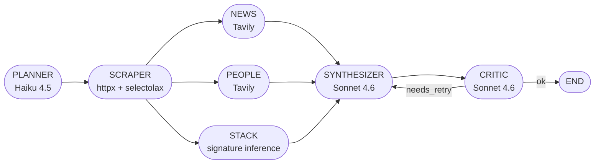

# ops-agent

Multi-step research agent for B2B sales. You give it a company URL and a buyer persona, it scrapes the site, searches recent news, infers the tech stack, infers a few decision-makers, scores ICP fit, and writes an outreach angle. Every node and every tool call streams to the UI as it happens, and everything gets persisted to Langfuse with token counts and dollar cost.

Live demo: deploy to Modal + Vercel, paste the URL here. There's also a static demo at `/example/linear`, `/example/faire`, `/example/allbirds` that replays pre-recorded runs without an API key.

## Agent graph



Seven nodes. Planner → scraper → parallel fan-out (news, people, stack) → synthesizer → critic. The critic decides whether to retry the synthesizer once. Every state transition is a typed Pydantic model, every node emits trace events the UI replays. The retry loop is bounded by `MAX_CRITIC_RETRIES` (default 1).

Architecture notes in [`ARCHITECTURE.md`](./ARCHITECTURE.md).

## Output

```jsonc
{
  "company": { "name", "domain", "industry", "size_estimate", "description" },
  "icp_fit_score": 0–100,
  "icp_reasoning":   [{ "claim", "evidence":[{url,title,snippet}], "confidence" }],
  "decision_makers": [{ "name", "title", "linkedin", "relevance", "confidence" }],
  "tech_stack":      [{ "category", "tool", "evidence", "confidence" }],
  "recent_signals":  [{ "date", "headline", "url", "buyer_relevance", "confidence" }],
  "recommended_outreach_angle": "string with 2+ concrete references",
  "confidence_warnings": ["[severity] field: issue", ...],
  "estimated_research_cost_usd": 0.04,
  "trace_url": "https://cloud.langfuse.com/trace/..."
}
```

The schema is enforced both by the synthesizer prompt and by Pydantic strict validation. Bad LLM output gets one repair pass; if that fails, the run errors loudly rather than silently degrading.

## Run it locally

```bash
# Backend
uv venv && source .venv/bin/activate
uv pip install -e '.[dev]'
cp .env.example .env  # ANTHROPIC_API_KEY + TAVILY_API_KEY
uvicorn backend.app.main:app --reload

# Frontend (another shell)
cd frontend
npm ci
NEXT_PUBLIC_API_URL=http://localhost:8000 npm run dev
```

Or `docker compose up`. Open `http://localhost:3000`.

## API

| Method | Path                          | Purpose                              |
|--------|-------------------------------|--------------------------------------|
| GET    | `/healthz`                    | Health check                         |
| GET    | `/personas`                   | List built-in buyer personas         |
| POST   | `/research`                   | Kick off a run (returns `job_id`)    |
| GET    | `/research/{job_id}`          | Final state + scorecard              |
| GET    | `/research/{job_id}/events`   | All persisted trace events           |
| GET    | `/research/{job_id}/stream`   | SSE, replays past events, then live |
| GET    | `/traces`                     | Last 50 runs with summary stats      |

POST `/research`:

```json
{
  "company_url": "https://linear.app",
  "persona_id":  "ae_series_b_saas",
  "persona_text": null
}
```

Either `persona_id` (preset) or `persona_text` (freeform ICP definition). Not both.

## Quality

| Check | How |
|---|---|
| Strict typing | mypy strict + Pydantic strict |
| Lint | ruff (E, F, W, I, B, UP, SIM, ASYNC, RUF, PL, PT, TID) |
| Tests | pytest + pytest-asyncio + respx |
| Coverage | ≥ 75% gate |
| Integration tests | End-to-end run with mocked Anthropic + Tavily + HTTP |
| Eval | 25 golden examples, field-wise metrics + LLM-judge (Cohen's kappa target ≥ 0.7) |
| Tracing | Langfuse, every node, every tool call |
| Secrets | `.env` is gitignored; `.env.example` is the source of truth |
| Versioned prompts | `agent/prompts/<name>.<vN>.md`, registry in code |
| Reproducible | `uv` lockfile, pinned deps, Dockerfile + compose.yml |

```bash
ruff check .
mypy backend/app
pytest --cov=backend/app --cov-fail-under=75
python -m evals.run --offline
```

## Layout

```
ops-agent/
├── backend/
│   ├── app/
│   │   ├── main.py             # FastAPI + SSE
│   │   ├── workers/runner.py   # End-to-end job orchestration
│   │   ├── agent/
│   │   │   ├── graph.py        # LangGraph wiring
│   │   │   ├── nodes/          # 7 nodes, one per file
│   │   │   ├── prompts/        # versioned prompt files
│   │   │   ├── llm.py          # JSON-mode call wrapper with one-shot repair
│   │   │   └── runtime.py      # Per-run trace context
│   │   ├── schemas/            # Strict Pydantic, state, scorecard, events
│   │   ├── clients.py          # Anthropic, Tavily, HTTP (retry-wrapped)
│   │   ├── store.py            # SQLite (WAL), runs + events
│   │   ├── sse.py              # In-memory pub/sub for live trace fan-out
│   │   ├── tracing.py          # Langfuse facade (no-op if keys missing)
│   │   └── pricing.py          # Versioned model price table
│   └── tests/                  # unit/ + integration/, respx-mocked
├── evals/
│   ├── golden_set.jsonl        # 25 (company_url, persona) examples
│   ├── metrics.py
│   ├── judge.py
│   ├── calibrate_judge.py      # Cohen's kappa vs human labels
│   └── run.py                  # offline | live
├── examples/                   # Pre-recorded fixtures for static demo
├── frontend/                   # Next.js 15 + Tailwind v4 + framer-motion
├── modal_app.py
├── compose.yml + Dockerfile
├── .github/workflows/          # ci.yml + eval.yml
└── ARCHITECTURE.md
```

## Deploy

Backend (Modal):

```bash
modal secret create ops-agent-secrets \
  ANTHROPIC_API_KEY=sk-ant-... TAVILY_API_KEY=tvly-...
modal deploy modal_app.py
```

Frontend (Vercel):

```bash
cd frontend
vercel --prod   # NEXT_PUBLIC_API_URL=<modal-url>
```

The `/example/[id]` pages don't need a backend; they replay pre-recorded runs from `examples/`.

## Things to know

- No LinkedIn scraping. Decision-maker discovery uses public Tavily search snippets only. Emails and phone numbers are not claimed; every entry has a confidence score.
- No paid stack-detection API. Stack inference is signature-based (response headers, cookie names, script srcs, `<meta generator>`). For enterprise detection, swap in BuiltWith or Wappalyzer behind the same node interface.
- Single-container job runner. One Modal container handles concurrency via tracked `asyncio.create_task`. For horizontal scale the `EventBroker` interface can swap to Redis Pub/Sub or NATS without touching node code.
- The static-demo fixtures ([`examples/linear.json`](./examples/linear.json), [`faire.json`](./examples/faire.json), [`allbirds.json`](./examples/allbirds.json)) are hand-curated. Every URL in them resolves; people and news searches are marked `skipped` rather than fabricated because they require Tavily. Use [`scripts/record_examples.py`](./scripts/record_examples.py) with real keys to overwrite them with live captures.
- The critic retry loop is bounded by `MAX_CRITIC_RETRIES` (default 1). The integration test in [`backend/tests/integration/test_end_to_end.py`](./backend/tests/integration/test_end_to_end.py) exercises both the happy path and the retry path.
- CI runs only once this is pushed to a GitHub remote.
